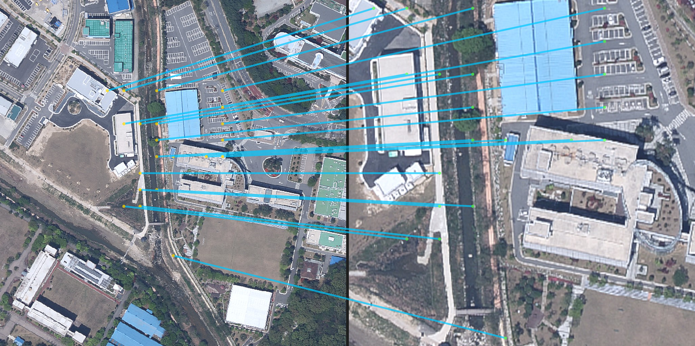

# DINOv3 Image Matching (Docker + WSL2)

DINOv3 기반 **이미지 매칭 & 시각화** 파이프라인. \
WSL2 + Docker Desktop + NVIDIA GPU 환경에서 재현 가능하도록 구성됨. \
여러 가중치(백본)와 All-vs-All 매칭을 실행.

> 내부 매칭은 DINOv3 패치 토큰을 이용한 **mutual k-NN** 방식이며, 결과는 JSON으로 저장되고, 선택적 **RANSAC**을 거쳐 PNG로 시각화.

---

## 0) 폴더 구조

아래 폴더 구조로 맞게 설정 필요:

```
project/
  imatch/            # 라이브러리 모듈들
  runCLI.py          # 매칭 실행기 (콘솔 진입점)
  visualize.py       # 시각화 스크립트
Dockerfile
docker-compose.yml
requirements.txt
.env.example         # ← 이걸 복사해 .env 수정/작성할 것
```

---

## 1) 커스터마이즈해야 할 로컬 항목

아래 **.env** 항목들을 각자 로컬에 맞게 수정 필요: \
(Windows 경로 `D:\...` 는 WSL에서 **`/mnt/d/...`** 로 변경됨)

| 항목 (.env 키)         | 설명                                   | 예시(각자 변경)                                             |
| ------------------ | ------------------------------------ | ----------------------------------------------------- |
| `PROJECT_HOST`     | 이 레포의 `project/`가 존재하는 WSL 경로        | `/home/<ubuntu_user>/dinov3-docker/project`           |
| `CODE_HOST`        | **`hubconf.py`가 있는 dinov3 리포 루트** 경로 | `/home/<ubuntu_user>/dinov3-src`                      |
| `WEIGHTS_HOST`     | 가중치(체크포인트) 루트(WSL 경로)                | `/mnt/d/GoogleDrive/KNK_Lab/_Projects/dinov3_weights` |
| `DATASET_HOST`     | 데이터셋 루트(WSL 경로)                      | `/mnt/d/GoogleDrive/KNK_Lab/_Datasets/shinsung_data`  |
| `EXPORT_HOST`      | 결과(Exports) 저장 루트(WSL 경로)            | `/mnt/d/Exports`                                      |
| `REPO_DIR`         | 컨테이너 내부에서 dinov3가 마운트될 경로(고정 권장)     | `/workspace/dinov3`                                   |
| `IMG_ROOT`         | 컨테이너 내부 데이터셋 경로(고정 권장)               | `/opt/datasets`                                       |
| `TZ`               | 컨테이너 타임존(선택)                         | `Asia/Seoul`                                          |
| `DINOV3_BLOCK_NET` | torch.hub 외부 다운로드 차단(권장)             | `1`                                                   |


> **예시 (Ubuntu 사용자: `nkangzach`)**
>
> ```env
> PROJECT_HOST=/home/nkangzach/dinov3-docker/project
> CODE_HOST=/home/nkangzach/dinov3-src
> WEIGHTS_HOST=/mnt/d/GoogleDrive/KNK_Lab/_Projects/dinov3_weights
> DATASET_HOST=/mnt/d/GoogleDrive/KNK_Lab/_Datasets/shinsung_data
> EXPORT_HOST=/mnt/d/Exports
> REPO_DIR=/workspace/dinov3
> IMG_ROOT=/opt/datasets
> TZ=Asia/Seoul
> DINOV3_BLOCK_NET=1
> ```

시각화 기본값: (`.env`에서 제어).

```
IMATCH_VIZ_ROOT=/exports/pair_match
IMATCH_VIZ_OUT=/exports/pair_viz
IMATCH_VIZ_FOCUS=
IMATCH_VIZ_MAX_LINES=1000
IMATCH_VIZ_LINEWIDTH=3
IMATCH_VIZ_DRAW_POINTS=0
IMATCH_VIZ_POINT_RADIUS=-1
IMATCH_VIZ_ALPHA=180
IMATCH_VIZ_RANSAC=homography
IMATCH_VIZ_RANSAC_IMPL=cv2_usac_magsac
IMATCH_VIZ_REPROJ_TH=8.0
IMATCH_VIZ_CONFIDENCE=0.9999
IMATCH_VIZ_ITERS=10000
```

(OpenCV 4.6 이상으로 업그레이드 시 USAC 계열 선택 가능)

---

## 2) 요구사항

* **Windows 11 + WSL2** (Ubuntu 20.04/22.04)
* **Docker Desktop** (Settings → Resources → **WSL Integration** 에서 Ubuntu ON)
* **NVIDIA GPU & Driver** (컨테이너에서 GPU가 보여야 함)

GPU 확인:

```bash
nvidia-smi
```

---

## 3) 설치 & 준비 순서 (최초 1회)

### 3-1) 레포 클론

```bash
git clone https://github.com/ZachNK/ImgMatching_DINOv3.git
cd ImgMatching_DINOv3
```

### 3-2) **dinov3 리포 준비**

```bash
git clone https://github.com/facebookresearch/dinov3.git ~/dinov3-src
ls -al ~/dinov3-src | head
```

### 3-3) **가중치(체크포인트) 배치**

가중치 폴더를 만들고 `.pth` 파일들을 배치. \
(아래는 권장 구조)

```
/mnt/d/GoogleDrive/KNK_Lab/_Projects/dinov3_weights
├─ 01_ViT_LVD-1689M
│  ├─ dinov3_vit7b16_pretrain_lvd1689m-a955f4ea.pth
│  ├─ dinov3_vitb16_pretrain_lvd1689m-73cec8be.pth
│  ├─ dinov3_vith16plus_pretrain_lvd1689m-7c1da9a5.pth
│  ├─ dinov3_vitl16_pretrain_lvd1689m-8aa4cbdd.pth
│  ├─ dinov3_vits16_pretrain_lvd1689m-08c60483.pth
│  └─ dinov3_vits16plus_pretrain_lvd1689m-4057cbaa.pth
├─ 02_ConvNeXT_LVD-1689M
│  ├─ dinov3_convnext_base_pretrain_lvd1689m-801f2ba9.pth
│  ├─ dinov3_convnext_large_pretrain_lvd1689m-61fa432d.pth
│  ├─ dinov3_convnext_small_pretrain_lvd1689m-296db49d.pth
│  └─ dinov3_convnext_tiny_pretrain_lvd1689m-21b726bb.pth
└─ 03_ViT_SAT-493M
   ├─ dinov3_vit7b16_pretrain_sat493m-a6675841.pth
   └─ dinov3_vitl16_pretrain_sat493m-eadcf0ff.pth
```

**CLI에서 사용할 가중치 별칭:**

|  ViT on web dataset  |  parameter  |
| -------------------- | ----------- |
| `ViT-S/16  distilled` | `vits16` |
| `ViT-S+/16  distilled`|  `vits16+` |
| `ViT-B/16  distilled` | `vitb16` |
| `ViT-L/16 distilled` | `vitl16` |
| `ViT-H+/16  distilled` | `vith16+` |
| `ViT-7B/16` | `vit7b16` |

|  ConvNeXt on web dataset  |  parameter  |
| ------------------------- | ----------- |
| `ConvNeXt Tiny` | `cxTiny` |
| `ConvNeXt Small` | `cxSmall` |
| `ConvNeXt Base` | `cxBase` |
| `ConvNeXt Large` | `cxLarge` |

|  ViT on satellite dataset  |  parameter  |
| -------------------------- | ----------- |
| `ViT-L/16 distilled` | `vitl16sat` |
| `ViT-7B/16` | `vit7b16sat` |


### 3-4) **데이터셋 배치**

`DATASET_HOST`(예: `/mnt/d/GoogleDrive/KNK_Lab/_Datasets/shinsung_data`) 아래에 이미지가 있어야 함. \
기본 파일명 패턴은 `..._<ALT(3자리)>_<FRAME(4자리)>.jpg`.

```
/mnt/d/GoogleDrive/KNK_Lab/_Datasets/shinsung_data
├─ 250912150549_400/250912150549_400_0100.jpg
├─ 250912161658_200/250912161658_200_0100.jpg
└─ ...
```

> 패턴이 다르면 `run-matching` 실행 시 `--regex`로 맞춰야 함.

### 3-5) **.env 작성 (중요!)**

```bash
cp .env.example .env
# 위 "1) 꼭 커스터마이즈" 표를 참고해 각 항목을 본인 로컬에 맞게 수정
```

### 3-6) **빌드 & 기동 & 점검**

```bash
docker compose build --no-cache
docker compose up -d

# 빠른 점검
docker compose exec pair nvidia-smi
docker compose exec pair bash -lc 'echo REPO_DIR=$REPO_DIR IMG_ROOT=$IMG_ROOT; ls -al $REPO_DIR | head'
```

---

## 4) 매칭 실행 (run-matching)

기본 명령은 컨테이너에서 다음과 같이 호출:

```bash
# 컨테이너 기본값을 사용 (필수 옵션: 가중치 선택)
docker compose exec pair run-matching --group ViT_LVD1689M
```

### 4-1) 이미지 선택 방식

`-a/--pair-a`, `-b/--pair-b`는 **ALT.FRAME (이미지파일별)** 또는 **ALT (고도별)** 단위로 지정 가능:

| 명령 | 동작 |
| ---- | ---- |
| `-a 300.0001 -b 150` | 이미지 `300.0001` ↔ ALT `150` 소속 전체 |
| `-a 300` | ALT `300` 소속 전체 × 전체 데이터셋 |
| `-a 300 -b 150` | ALT `300` 전체 × ALT `150` 전체 |
| (생략) | 전체 이미지 All-vs-All |

### 4-2) 가중치 선택

```bash
# 모든 가중치
docker compose exec pair run-matching --all-weights

# 그룹 단위
docker compose exec pair run-matching --group ViT_SAT493M

# 임의 지정
docker compose exec pair run-matching --weights vitl16sat
```

### 4-3) 고급 옵션 (Advanced Setting)

매칭 설정을 CLI에서 직접 제어 (Hugging Face Image Matching WebUI 참조함).

| 옵션 | 명칭 | 기본값 | 범위/설명 |
| ---- | ------ | ------ | -------- |
| `--match-th` | Match threshold | `0.1` | 0~1, 코사인 유사도 임계값 (버리면 기본 유지) |
| `--max-features` / `--max-ft` | Max features | `1000` | 10~10000, 패치 토큰 최대 개수 |
| `--keypoint-th` | Keypoint threshold | `0.015` | 0~1, 패치 토큰 보존 임계값 |
| `--line-th` | Line threshold | `0.2` | 0~1, 상대 유사도 기반 라인 필터링 |
| `--mutual-k` | Mutual k-nn | `10` | mutual k-NN 이웃 수 |
| `--topk` | Top-K | `400` | 최고 유사도 매칭 수 제한 |
| `--image-size` | Input image size | `336` | 입력 이미지 리사이즈 크기 |
| `--device` | GPU option | `cuda`/`cpu` | GPU 미사용 시 `--device cpu` |

모든 파라미터는 JSON 내 `advanced_settings`와 `patch` 블록에 기록되어 후속 분석에 활용.

### 4-4) 출력 구조

* **매칭 JSON**: `/exports/pair_match/<weight>_<Aalt>_<Aframe>/<weight>_<Aalt.Aframe>_<Balt.Bframe>.json`
* JSON에는 `meta`, `cosine`, `advanced_settings`, `patch(similarities/idx/n_selected 등)`이 포함.

Windows에서는 `\\wsl$\Ubuntu-20.04\...` 또는 마운트 드라이브 (`D:\Exports\...`)에서 확인 가능.

---

## 5) 시각화 실행 (run-visualize)

기본 명령:

```bash
docker compose exec pair run-visualize
```

### 5-1) 대상 선택 (Focus)

`--focus`에 디렉터리/JSON/패턴을 넘겨 원하는 결과만 도출 가능. \
값을 생략하면 실행 시 인터랙티브 목록이 표시됨.

```bash
# 특정 디렉터리만
docker compose exec pair run-visualize --focus vitl16_300

# 여러 항목
docker compose exec pair run-visualize --focus vitl16_300 vitl16_305/*.json
```

환경변수 `IMATCH_VIZ_FOCUS`에 콤마 구분으로 미리 지정 가능.

### 5-2) 경로 설정

| 옵션/ENV | 기본값 | 설명 |
| -------- | ------ | ---- |
| `--root` / `IMATCH_VIZ_ROOT` | `/exports/pair_match` | 입력 JSON 루트 |
| `--out` / `IMATCH_VIZ_OUT` | `PAIR_VIZ_DIR` (`/exports/pair_viz`) | PNG 저장 루트 |

### 5-3) 시각화 옵션

| 옵션 | 기본값 | 설명 |
| ---- | ------ | ---- |
| `--max-lines` / `IMATCH_VIZ_MAX_LINES` | 1000 | 그릴 매칭 수 (0이면 생략) |
| `--linewidth` / `IMATCH_VIZ_LINEWIDTH` | 3 | 선 두께 (0이면 선 미표시) |
| `--draw-points` / `--no-points` / `IMATCH_VIZ_DRAW_POINTS` | 기본 false | 매칭 지점 원 표시 |
| `--point-radius` / `IMATCH_VIZ_POINT_RADIUS` | -1 | -1 자동, 0 숨김, 양수는 픽셀 |
| `--alpha` / `IMATCH_VIZ_ALPHA` | 180 | 선/점 오버레이 알파 (0~255) |

### 5-4) RANSAC 설정

| 옵션 | 기본값 | 설명 |
| ---- | ------ | ---- |
| `--ransac` / `IMATCH_VIZ_RANSAC` | `homography` | `off` / `affine` / `homography` |
| `--ransac-method` / `IMATCH_VIZ_RANSAC_IMPL` | OpenCV 탐지값 | OpenCV가 지원하는 Homography 플래그 선택 (`cv2_usac_magsac`, `cv2_ransac` 등) |
| `--reproj-th` / `IMATCH_VIZ_REPROJ_TH` | 8.0 | 재투영 임계값 (0~12) |
| `--confidence` / `IMATCH_VIZ_CONFIDENCE` | 0.9999 | RANSAC 신뢰도 (0~1) |
| `--iters` / `IMATCH_VIZ_ITERS` | 10000 | 반복 횟수 (0~100000) |

OpenCV 버전에 따라 사용 가능한 플래그가 달라짐. \
4.6 이상(opencv-contrib)에서는 `cv2_usac_*` 계열이 자동으로 식별됨.\
현재 컨테이너: OpenCV==4.10.0. 

### 5-5) 실행 예시

```bash
# 기본값으로 실행 (환경변수 기반)
docker compose exec pair run-visualize
```

아래와 같이 시각화할 matching 결과 저장 디렉토리의 리스트가 열거됨:


_`시각화할 항목 번호 또는 경로(콤마 구분)를 입력하세요:`_ 란에 해당 번호를 입력하면 시각화 파일 저장됨.

```bash

# 선 없이 지점만 표현, 포커스 지정
docker compose exec pair run-visualize --focus vitl16_300 --linewidth 0 --draw-points --point-radius 2

# RANSAC Method = USAC MAGSAC 사용시
docker compose exec pair run-visualize --ransac homography --ransac-method cv2_usac_magsac --reproj-th 6 --confidence 0.999 --iters 5000
```

생성 결과:

* **시각화 PNG**: `/exports/pair_viz/<weight>_<Aalt>_<Aframe>/<same_base>.png`
* 필요 시 Windows에서 `D:\Exports\pair_viz\...` 확인

---

## 6) 예시 워크플로우

```bash
# 1. 특정 ALT vs ALT 매칭
docker compose exec pair run-matching --weights vitl16 -a 300 -b 150

# 2. 결과 일부 시각화 (인터랙티브 선택)
docker compose exec pair run-visualize

# 3. 특정 디렉터리만 다시 렌더링
docker compose exec pair run-visualize --focus vitl16_300 --max-lines 200 --alpha 200
```

예시 결과:

**매칭 시각화 (PNG)**


**매칭 결과 (JSON)**
[(JSON)](docs/examples/vitl16_400_0100/matches_vitl16_A400.0100_B200.0100.json)

---
* `--mutual-k` (기본 10)
* `--topk` (기본 400)
* `--max-patches` (기본 0 → 전체 사용, >0 이면 균등 서브샘플링)
* `--regex` (파일명 패턴, 기본: `.*_(?P<alt>\d{3})_(?P<frame>\d{4})\.(jpg|jpeg|png|bmp|tif|tiff|webp)$`)
* `--weights` / `--group` / `--all-weights` (가중치 선택)

**시각화(run-visualize)**

* `--ransac {off|affine|homography}` (기본 off)
* `--reproj-th`, `--confidence`, `--iters`
* `--max-lines`, `--linewidth`, `--draw-points`, `--alpha`

---

## 7) 트러블슈팅(FAQ)

* **Docker 명령이 WSL에서 안 보임**
  Docker Desktop → Settings → Resources → **WSL Integration**에서 Ubuntu ON,
  PowerShell(관리자)에서 `wsl --shutdown` 후 재실행.

* **GPU가 안 보임**
  `docker compose exec pair nvidia-smi` 확인. 보이지 않으면 호스트 드라이버/WSL 통합 점검.

---

