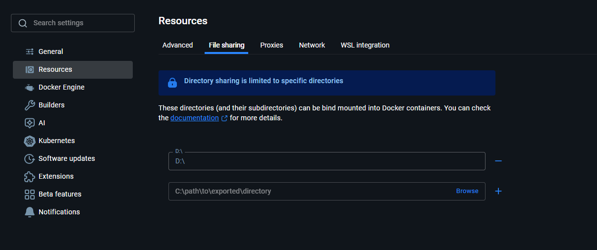

# DINOv3 Image Matching (Docker)

Docker Desktop 위에서 DINOv3 기반 이미지 매칭과 시각화를 수행하기 위한 프로젝트.  
컨테이너 안에서는 1:1 매칭을 수행하도록 구성되어 있으며, 결과(JSON/PNG)는 호스트의 지정된 디렉터리에 저장.

---

## 0) 요구 사항

- **Windows 11** + **Docker Desktop (v.4.46.0 이상)**  
  - Docker Desktop 환경에서 동작.  
  - Docker Desktop Settings → Resources → File Sharing 에서 프로젝트/데이터 폴더가 공유되어 있는지 확인.
- **NVIDIA GPU & 최신 드라이버** (CUDA 12.x 호환)
- **NVIDIA Container Toolkit** (Docker Desktop 설치 시 자동 포함)
- 권장 체크 명령
  ```powershell
  docker --version
  nvidia-smi
  ```


### 0-1) Docker Desktop 설치
- 개인 PC 운영체제에 맞는 Docker Desktop 다운로드 후 설치 
- 본 프로젝트는 `4.46.0` 버전 사용

- 개인 PC 시스템 환경 확인
```powershell
Get-CimInstance Win32_Processor | Select-Object -ExpandProperty Architecture
```

  > _출력결과_:
  ```powershell
  # x64 (AMD64)
  9 

  # ARM64
  12
  ```

- Docker Desktop 설치: 
  > https://www.docker.com/

<p align="center">
  
  <figcaption align="center">(출력결과 9: AMD64 설치, 출력결과 12: ARM64 설치)</figcaption>
  <figcaption align="center">대부분 Desktop/노트북은 x64(AMD64), Intel CPU사용하더라도 AMD64를 받는것이 일반적</figcaption>
</p>


### 0-2) Docker Desktop 설치 후 기본 설정
- Docker Desktop 실행 → 리소스 제한 (CPU/Memory) → WSL2 (Windows) 연동 등 환경 설정 확인
- 프로젝트에 필요한 GPU 관련 드라이버/Container Runtime(NVIDIA Container toolkit) 설치

### 0-3) 프로젝트 디렉터리 준비
- 로컬 경로를 미리 생성한다.\
  작업할 디렉토리: `<Your>\<Project>\<Directory>` 로 가정할 때,
  
  ```bash
  mkdir <Your>\<Project>\<Directory>\dinov3_main      # 본 프로젝트 경로
  mkdir <Your>\<Project>\<Directory>\dinov3_src       # DINOv3
  mkdir <Your>\<Project>\<Directory>\dinov3_weights   # DINOv3에서 제공한 백본 경로
  mkdir <Your>\<Project>\<Directory>\dinov3_data      # 활용할 입력 데이터셋 경로
  mkdir <Your>\<Project>\<Directory>\dinov3_exports   # 본 프로젝트의 출력 저장 경로
  ```

- 그리고 Docker Desktop에 Docker Desktop Settings → Resources → File Sharing 에서 프로젝트/데이터 폴더가 공유되어 있는지 확인
<p align="center">
  
  <figcaption align="center">File Sharing 에서 프로젝트/데이터 폴더가 공유되어 있는지 확인 (본 프로젝트는 D: 에 공유됨)</figcaption>
</p>


### 0-4) 환경 변수 파일 작성
- `.env.example` 파일을 이용하여 `.env` 파일을 생성해야 한다.
- .env.example 파일을 .env 파일명으로 복사:
  ```bash
  cp .env.example .env
  ```

- `.env`파일을 연다.
- 건드려야 할 곳은 `호스트 경로` 부분 5군데이다. 나머지는 건들지 않는 곳.

  `.env`에서 자신의 환경에 맞게 수정. 모든 경로는 **Windows 경로**로 작성.

  | 변수 | 설명 | 예시 (Windows) |
  | --- | --- | --- |
  | `PROJECT_HOST` | `project/` 폴더 실경로 | `D:\GoogleDrive\KNK_Lab\_Projects\dinov3_main\project` |
  | `CODE_HOST` | dinov3 원본 리포지터리 | `D:\GoogleDrive\KNK_Lab\_Projects\dinov3_src` |
  | `WEIGHTS_HOST` | `.pth` 가중치 루트 | `D:\GoogleDrive\KNK_Lab\_Projects\dinov3_weights` |
  | `DATASET_HOST` | 이미지 데이터셋 루트 | `D:\GoogleDrive\KNK_Lab\_Projects\dinov3_data` |
  | `EXPORT_HOST` | JSON/PNG 결과 저장 루트 | `D:\GoogleDrive\KNK_Lab\_Projects\dinov3_exports` |


### 0-5) Docker Compose 빌드 단계
- 본격적으로 docker로 사용하기에 앞서 프로젝트 루트에서  `docker compose build` 실행.
  ```powershell
  docker compose build
  ```
  
  * 그러면 빌드 하면서 마지막에 
  ```powershell
  [+] Building 1/1
  ✔ dinov3:cuda12.1-py310  Built
  ```

### 0-6) Docker 컨테이너 실행 및 확인
- Docker 컨테이너 실행:
  ```powershell
  docker compose up -d
  ```
  
  * 그러면 컨테이너가 실행 준비 완료 되었다는 것을 다음과 같이 나온다:
  ```powershell
  [+] Running 2/2
  ✔ Network dinov3_main_default  Created                   0.0s 
  ✔ Container dinov3-matching    Started                   0.5s 
  ```

- 컨테이너 실행 하는지 확인:
  ```powershell
  docker compose ps
  ```

  * 그려면 아래와 같이 나옴:
  ```bash
  NAME              IMAGE                   COMMAND                   SERVICE    CREATED         STATUS         PORTS
  dinov3-matching   dinov3:cuda12.1-py310   "bash -lc 'sleep inf…"   matching   8 seconds ago   Up 7 seconds
  ```

### 0-7) Docker 초기 진입/테스트 
- 컨테이너 쉘 진입하여 기본 매칭/시각화 명령을 한번씩 수행하고, 결과 파일이 HOST경로에 생성되는지 확인:
  ```powershell
  docker compose exec matching bash
  ```
  
  * 그러면 아래와 같이 나오면 컨테이너 쉘 진입 확인 완료
  ```powershell
  root@{...}:/workspace/project#
  ```
  * `exit` 명령어로 쉘 나오기
  ```powershell
  root@{...}:/workspace/project# exit
  ```

- GPU 인식 체크로 드라이버/Toolkit 연동 상태 확인
  ```powershell
  docker compose exec matching nvidia-smi
  ```
  * `NVIDIA-SMI ~ Driver Version ~` 등 뜨면 정상적으로 Toolkit 연동

---

## 1) 저장소 구조 & 필수 리소스

- 아래와 같이 `dinov3_main` 의 디렉터리는 다음과 같이 있어야 한다.

```bash
dinov3_main/
├─ project/
│  ├─ imatch/           # 라이브러리 모듈
│  ├─ run.py            # 매칭 실행 엔트리
│  └─ visualize.py      # 시각화 엔트리
├─ Dockerfile
├─ docker-compose.yml
├─ requirements.txt
├─ .env
├─ .env.example
└─ README.md
```

필수 리소스 (작업할 디렉토리: `<Your>\<Project>\<Directory>` 라고 가정)
- **본 실행 프로젝트**  
  _예시 위치:_ `<Your>\<Project>\<Directory>\dinov3_main`

- **facebookresearch/dinov3** 저장소 (코드 참조용)  
  _예시 위치:_ `<Your>\<Project>\<Directory>\dinov3_src`

- **사전 학습 가중치(.pth)**  
  _예시 위치:_ `<Your>\<Project>\<Directory>\dinov3_weights`

- **매칭 대상 이미지 데이터셋**  
  _예시 위치:_ `<Your>\<Project>\<Directory>\dinov3_data`

- **결과 저장 디렉터리**  
  _예시 위치:_ `<Your>\<Project>\<Directory>\dinov3_exports`


### 1-1) DINOv3 원본 저장


작업하고자 하는 디렉토리(_`<Your>\<Project>\<Directory>`_)에 먼저 접근하여 본 프로젝트를 `dinov3_main` 하위 경로에 clone한다. 

```bash
git clone https://github.com/ZachNK/ImgMatching_DINOv3.git .\dinov3_main
```

### 1-2) DINOv3 원본 저장


작업할 경로 (_`<Your>\<Project>\<Directory>`_)에서 `dinov3_src` 하위 경로에 DINOv3 원본을 저장한다.

```bash
git clone https://github.com/facebookresearch/dinov3.git .\dinov3_src
```

### 1-3) 백본 백본 준비 

_`<Your>\<Project>\<Directory>`_ 경로에 `dinov3_weights` 라는 디렉토리 생성하여 백본 데이터를 준비 한다.\
https://github.com/facebookresearch/dinov3에 게시된 가중치를 `dinov3_weights`이라는 폴더를 생성하고 바로 저장한다.

```powershell
# dinov3_weights 디렉토리 생성. 해당 경로에 ViT-S/16 distilled, ConvNeXt Tiny, ... , ViT-7B/16 를 저장
New-Item -ItemType Directory -Path <Your>\<Project>\<Directory>\dinov3_weights -ErrorAction SilentlyContinue
```

```powershell
# dinov3_weights에 디렉토리 추가 생성
New-Item -ItemType Directory -Path <Your>\<Project>\<Directory>\dinov3_weights\01_ViT_LVD-1689M -ErrorAction SilentlyContinue
New-Item -ItemType Directory -Path <Your>\<Project>\<Directory>\dinov3_weights\02_ConvNeXT_LVD-1689M -ErrorAction SilentlyContinue
New-Item -ItemType Directory -Path <Your>\<Project>\<Directory>\dinov3_weights\03_ViT_SAT-493M -ErrorAction SilentlyContinue
```

```powershell
# dinov3_weights 디렉토리에 저장된 .pth 파일들 데이터셋별로 정리

# 1) dinov3_weights\01_ViT_LVD-1689M에 파일 이동 (ViT-S/16 distilled 이동할 때)
Move-Item -Path <Your>\<Project>\<Directory>\dinov3_vits16_pretrain_lvd1689m-08c60483.pth -Destination <Your>\<Project>\<Directory>\dinov3_weights\01_ViT_LVD-1689M

# ... 나머지 ViT-S+/16 distilled, ViT-B/16 distilled 등 .pth파일 이동

# 2) dinov3_weights\02_ConvNeXT_LVD-1689M에 파일 이동 (ConvNeXt Tiny 이동할 때)
Move-Item -Path <Your>\<Project>\<Directory>\dinov3_convnext_tiny_pretrain_lvd1689m-21b726bb.pth -Destination <Your>\<Project>\<Directory>\dinov3_weights\01_ViT_LVD-1689M

# ... 나머지 ConvNeXt Small, ConvNeXt Base 등 .pth파일 이동

# 3) dinov3_weights\03_ViT_SAT-493M에 파일 이동 (ViT-L/16 distilled 이동할 때)
Move-Item -Path <Your>\<Project>\<Directory>\dinov3_vitl16_pretrain_sat493m-eadcf0ff.pth -Destination <Your>\<Project>\<Directory>\dinov3_weights\01_ViT_LVD-1689M

# ... 나머지 dinov3_vit7b16_pretrain_sat493m-a6675841.pth .pth파일 이동
```


### 1-4) 데이터셋 준비

- 마찬가지로 데이터셋도 추가 디렉토리를 생성한다.

  ```powershell
  # dinov3_data 디렉토리 생성.
  New-Item -ItemType Directory -Path <Your>\<Project>\<Directory>\dinov3_data
  ```

- `dinov3_data` 경로에 활용할 데이터셋을 저장한다.\
  아래와 같이 일관된 경로로 수정해야 한다.\
  `<ID>`는 세부 데이터셋 명이고, `<ALT>`는 항공 사진의 고도, `<FRAME>`은 해당 고도에서 촬영한 이미지 순번.

  ```bash
  <Your>\<Project>\<Directory>\dinov3_data
    └─<Your>\<Project>\<Directory>\dinov3_data\<ID>_<ALT>
        └─<Your>\<Project>\<Directory>\dinov3_data\<ID>_<ALT>\<ID>_<ALT>_<FRAME>.jpg
  ```

- 본 프로젝트의 데이터셋 경로 예시
  ```bash
  <Your>\<Project>\<Directory>\dinov3_data
    └─<Your>\<Project>\<Directory>\dinov3_data\250912143954_450
        └─<Your>\<Project>\<Directory>\dinov3_data\250912143954_450\250912143954_450_0001.jpg
  ```

### 1-5) 디렉토리 최종

- 본 프로젝트 `dinov3_main`에서 실행한 후 도출한 결과들을 저장할 디렉토리 `dinov3_exports`에 생성한다.\
  최종 경로 상태는 아래와 같다:

  ```text
  <Your>\<Project>\<Directory>\
  ├─ dinov3_main\
  │  ├─ project\
  │  │  ├─ imatch\
  │  │  ├─ run.py
  │  │  └─ visualize.py
  │  ├─ Dockerfile
  │  ├─ docker-compose.yml
  │  ├─ requirements.txt
  │  ├─ .env
  │  ├─ .env.example
  │  └─ README.md
  ├─ dinov3_src\                 # facebookresearch/dinov3 clone
  │  ├─ .github
  │  ├─ __pycache__  
  │  ├─ dinov3  
  │  ├─ notebooks  
  │  ├─ .docstr.yaml
  │  └─ hubconf.py 등...
  ├─ dinov3_weights\
  │  ├─ 01_ViT_LVD-1689M\
  │  │  └─ *.pth
  │  ├─ 02_ConvNeXT_LVD-1689M\
  │  │  └─ *.pth
  │  └─ … (필요한 가중치별 디렉터리)
  ├─ dinov3_data\                # 매칭 대상 이미지/데이터셋
  │  └─ … (프로젝트별 입력 데이터)
  └─ dinov3_exports\             # 결과(JSON/PNG/npy) 저장
    ├─ dinov3_embeds\
    ├─ pair_match\
    └─ pair_vis\
  ```

---

## 2) Docker 이미지 빌드 & 컨테이너 실행

```powershell
docker compose build        # Dockerfile 변경 시 재빌드
docker compose up -d        # 컨테이너 백그라운드 실행
docker compose ps           # 상태 확인
```

변경 사항 적용 또는 `.env`를 수정한 뒤에는 `docker compose up -d --force-recreate`로 재생성.  
GPU가 인식되는지 확인:

```powershell
docker compose exec matching nvidia-smi
```

---

## 3) 매칭 실행 (`run`)

컨테이너 래퍼 명령은 `run` 

```powershell
docker compose exec matching run --weights vitl16 -a 400.0200 -b 200.0200
```

- `-a`, `-b`: ALT.FRAME 형식 (예: `400.0200`) \
  지정하지 않으면 모든 조합을 순회.

- `--weights`, 혹은 `-w`: 사용 가중치 변수\
  `--group`, `--all-weights` 옵션도 지원.

  | backbone | parameter |
  | -------- | ---- |
  | `ViT-S/16 distilled` | `vits16` |    
  | `ViT-S+/16 distilled` |`vits16+` |   
  | `ViT-B/16 distilled` | `vitb16` |
  | `ViT-L/16 distilled` | `vitl16` | 
  | `ViT-H+/16 distilled` | `vith16+` |
  | `ViT-7B/16` | `vit7b16` |
  | `ConvNeXt Tiny` | `cxTiny` |  
  | `ConvNeXt Small` | `cxSmall` |  
  | `ConvNeXt Base` | `cxBase` |   
  | `ConvNeXt Large` | `cxLarge` |  
  | `ViT-L/16 distilled` | `vitl16sat` | 
  | `ViT-7B/16` | `vit7b16sat` |


- 주요 튜닝 파라미터
  | 옵션 | 기본값 | 설명 |
  | --- | --- | --- |
  | `--image-size` | 336 | 입력 해상도 |
  | `--max-features` | 1000 | 패치 토큰 최대 개수 (균등 샘플링) |
  | `--match-th` | 0.1 | 유사도 절대 임계값 |
  | `--keypoint-th` | 0.015 | 토큰 L2 임계값 |
  | `--line-th` | 0.2 | 최고 유사도 대비 상대 임계값 |

- 결과 JSON은 _`<Your>\<Project>\<Directory>\dinov3_exports/pair_match/<weight>_<ALT>_<FRAME>/…`_ 에 저장.

---

## 4) 시각화 (`vis`)

```powershell
# 대화형 선택 
docker compose exec pair vis
```

주요 옵션
| 옵션 | 기본값 (환경변수) | 설명 |
| --- | --- | --- |
| `--root` | `/exports/pair_match` (`IMATCH_VIZ_ROOT`) | JSON 루트 |
| `--out` | `/exports/pair_viz` (`IMATCH_VIZ_OUT`) | PNG 출력 루트 |
| `--ransac` | `homography` | `off/affine/homography` |
| `--reproj-th` | 8.0 | 투영 오차 임계값 |
| `--confidence` | 0.9999 | RANSAC 신뢰도 |
| `--max-lines` | 1000 | 그릴 매칭 수 (0이면 미표시) |
| `--draw-points` | OFF | 점 표시 여부 |

실행 결과는 호스트 `EXPORT_HOST\pair_viz\…`에서 확인.

---

## 5) 결과 확인 & 경로 정리

- JSON: `EXPORT_HOST\pair_match\<weight>_<ALT>_<FRAME>\*.json`
- PNG: `EXPORT_HOST\pair_viz\<weight>_<ALT>_<FRAME>\*.png`
- JSON 내용
  - `meta`: 실행 환경 정보
  - `advanced_settings`: 사용한 매칭/필터 파라미터 (`matching_mode`는 현재 `mutual_knn_k1_unique`)
  - `patch`: 선택된 패치 정보 (`idx_a`, `idx_b`, `similarities` 등)

필요 시 결과 폴더를 탐색기에서 바로 열어 확인.

---

## 6) 트러블슈팅

| 증상 | 확인 사항 & 해결 팁 |
| --- | --- |
| Docker 명령 실패 / 권한 오류 | Docker Desktop 재시작, 관리자 PowerShell에서 실행 |
| 컨테이너에서 GPU 미노출 | `docker compose exec pair nvidia-smi` 확인 → NVIDIA 드라이버/NVIDIA Container Toolkit 재설치 |
| 볼륨 마운트 실패 | Docker Desktop Settings → Resources → File Sharing 에서 각 드라이브 허용 여부 확인 |
| 매칭 JSON이 생성되지 않음 | `pairs_to_run=0` 인 경우 ALT.FRAME 조합이 존재하지 않는 것 → 데이터셋 이름/정규식 확인 |
| 1:1 매칭이 맞지 않는 것처럼 보임 | `run` 내부에서 자동으로 1:1을 강제함. PNG 상에서 선이 적게 보인다면 RANSAC 필터를 완화하거나 `vis --ransac off`로 검증 |
| 기타 로그 | `docker compose logs -f pair` 로 컨테이너 로그 확인 |

---

필요한 경우 `docker compose exec pair bash`로 컨테이너 내부에 진입하여 추가 디버깅을 진행 가능.  

